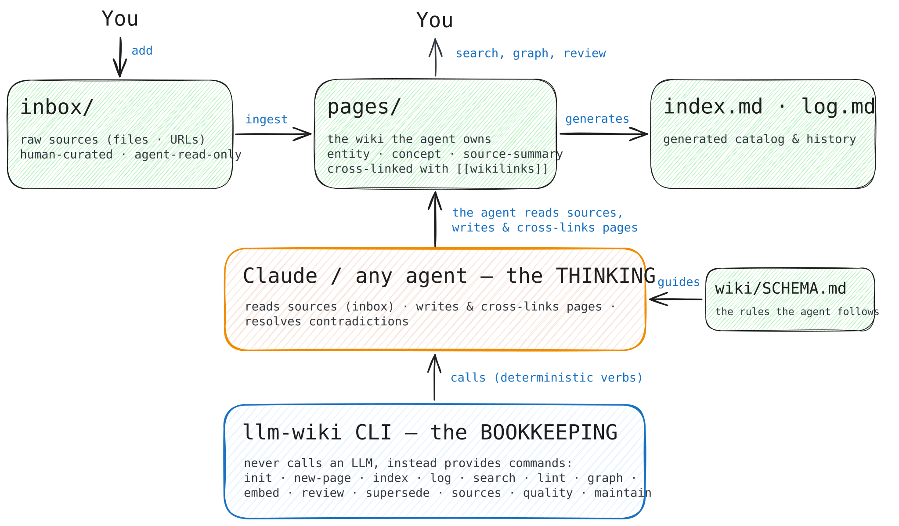

<p align="center">
  
</p>

# autowiki

Initialize and maintain [Karpathy-style LLM wikis](https://gist.github.com/karpathy/442a6bf555914893e9891c11519de94f)
in any new or existing project. An agent maintains an interconnected set of markdown notes about
your sources; `autowiki` does the deterministic bookkeeping (scaffolding, indexing, linking, search,
lint) so the agent can focus on the reading and writing.

The use case it was built for: documenting your own coding projects as you build them with LLMs — a
self-managed, self-fueled wiki that the agent keeps current in the background, so you always have an
up-to-date picture of the current state of what you're building instead of it living only in chat logs.

## How it works

<p align="center">
  
</p>

## Install (local dev)

```
git clone https://github.com/mxmzb/autowiki.git
cd autowiki
uv tool install --editable .
```

Edits to the source take effect immediately, but the globally-installed tool has its own isolated
environment — after a **dependency change** (e.g. a new package), re-run
`uv tool install --editable . --reinstall` so the global `autowiki` picks it up.

## Quick start

```
autowiki init . --target claude      # scaffold wiki/ + CLAUDE.md managed block + slash commands
                                     #   --target generic for AGENTS.md; --root for a wiki at repo root
                                     #   --hooks to install opt-in Claude hygiene hooks
                                     #   asks whether wiki updates travel with code PRs or follow merges
autowiki add-source notes.md         # vendor an existing file/URL into wiki/inbox/  → prints a source id
autowiki new-source "Meeting Notes"  # create a fresh inbox source (empty, or pipe content in)
autowiki new-page "Topic" --type concept --summary "…" --sources <id>
autowiki set <slug> --confidence 0.8 --add-source <id>  # update frontmatter (validates, bumps `updated`)
autowiki index                       # rebuild index.md from page frontmatter
autowiki log ingest "Topic"          # append to the chronological log.md
autowiki search "query"              # keyword search (hybrid keyword+semantic when embeddings are set up)
autowiki lint --fix                  # structural health check (orphans, broken links, stale, …)
autowiki graph neighbors <slug>      # explore the knowledge graph (also: path / hubs / stats / export)
autowiki supersede <old> <new>       # mark old superseded by new (kept, but dropped from the catalog)
autowiki review                      # surface pages that have decayed or are past review_by
autowiki sources --pending           # inbox sources not yet ingested into a page
autowiki quality                     # weakest pages (missing summaries, sources, links)
autowiki maintain                    # one-shot pass: rebuild index + lint/review/pending/quality report
autowiki status                      # page counts, status/tier breakdown, review-due, lint summary
autowiki doctor                      # health/setup check
autowiki upgrade                     # refresh schema/commands/block to the installed version
```

For scripted installs, use `--yes` to accept the recommended `alongside_pr` workflow, or choose
explicitly with `--wiki-update-mode alongside-pr|after-merge`. Re-running `init` preserves the saved
choice unless that option is supplied. Existing installations without the setting retain the legacy
`after_merge` workflow when upgraded.

With `--hooks`, a SessionStart hook greets each Claude session with what needs attention (pending
sources, pages due for review, lint errors) so the in-session agent can act on it.

**Semantic search (optional):** `pip install 'autowiki[embeddings]'`, then `autowiki embed` to build a
local vector index — `search` then fuses keyword + semantic results, and `autowiki similar <slug>` finds
near-duplicate pages. Without the extra, search stays keyword-only.

Commands resolve the wiki from the current directory (walking up, and into a `wiki/` subdir), or
pass `--wiki <path>`.

## Layout

```
wiki/
├── inbox/        raw human-curated sources (agent read-only; add via `add-source`)
├── pages/        agent-owned markdown pages (entity | concept | source-summary | note)
├── index.md      generated catalog
├── log.md        append-only chronological ledger
├── SCHEMA.md     the maintainer playbook (edit to customize page types, rules, stale threshold)
└── .autowiki.toml
```

`index.md` and `log.md` are generated — let `autowiki` manage them. `inbox/` is read-only to the agent.

**Your own frontmatter is safe.** Add whatever keys your project needs to a page — `autowiki`
ignores keys it does not define, but preserves them verbatim through every write path
(`set`, `supersede`, `lint --fix`, `upgrade`). Known fields are emitted first, then yours in
their original order. Document what they mean in `SCHEMA.md`.

It's all plain markdown with `[[slug]]` wiki-links, so it looks great in [Obsidian](https://obsidian.md) —
open the `wiki/` folder as a vault and you get live backlinks and the graph view over your pages for free.
